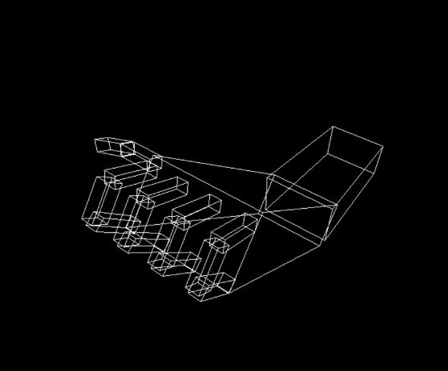

# **Task1: Robotic Arm**

## Abstract:

In this task we completed the robotic arm model by adding missing fingers. We also applied transformation techniques to define and describe the movements for each of the arm and fingers then we set the movement limitations by using user defined functions `(min(), max())` in the keyboard function. Arm and finger movements are controlled by using keyboard keys.

### Keyboard Control Keys:
Keys | Action
-----|--------
E and e | Rotate the elbow joint in two opposite directions
R and r | Rotate the thumb around X-axis in two opposite directions
S and s | Rotate the shoulder joint in two opposite directions around z-axis
D and d | to move the last fingertip in two opposite directions
G and g | to move the middle fingertip in two opposite directions
F and f | to move the first fingertip in two opposite directions
( 1, q ) and ( 2, w ) | tos move the ring and little finger in two opposite directions
________________________________

## Result Samples:





## Problems Faced:

It was hard to memorize and deduce the value of the current matrix and the stack contents for each code block, so we added comments for about each line to make stack and matrix values traceable in an easy way to solve this problem.
```
glPopMatrix();    // s1 , cm = s2
glPushMatrix();    // s2 , cm = s2
```